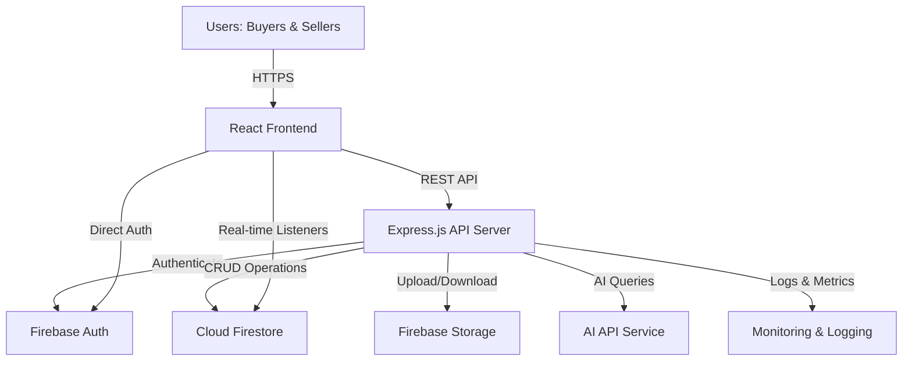
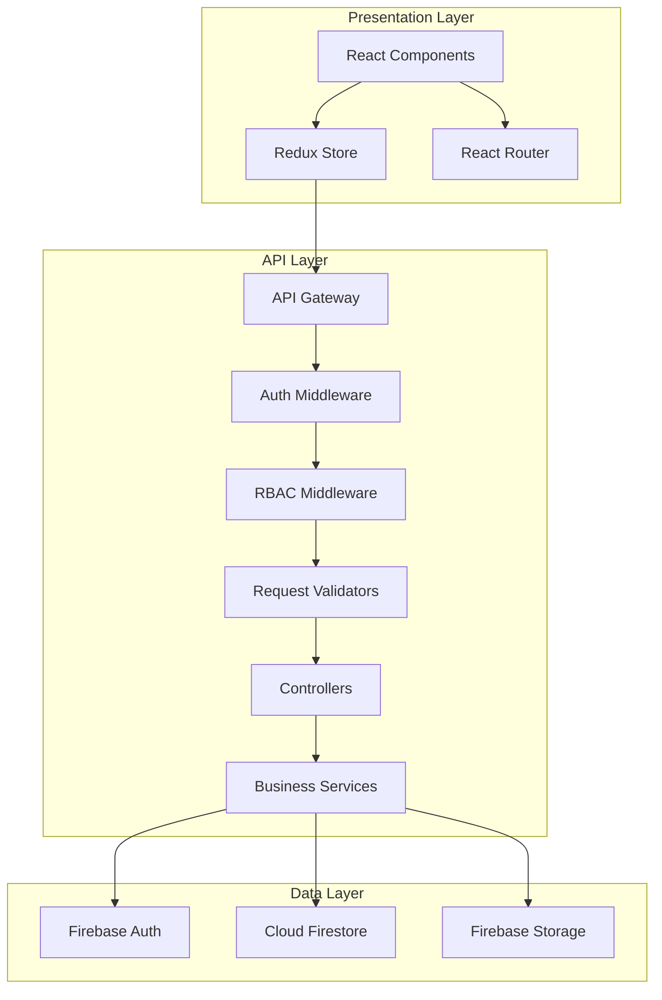

# Design Document: Estate Bridge MERN Platform

## Overview

Estate Bridge is an industry-grade, production-ready real estate platform built on a modern MERN-like architecture with Firebase as the backend infrastructure. The platform provides a secure, scalable, and performant solution for property listing, search, and communication between buyers and sellers.

### Architecture Philosophy

The design follows industry best practices for enterprise-level applications:

- **Separation of Concerns**: Clear boundaries between presentation, business logic, and data layers
- **Security-First**: Defense in depth with multiple security layers (authentication, authorization, input validation, rate limiting)
- **Scalability**: Horizontal scaling capabilities with stateless API design and Firebase's managed infrastructure
- **Observability**: Comprehensive logging, monitoring, and error tracking
- **Maintainability**: Modular architecture with clear interfaces and dependency injection
- **Performance**: Optimized for speed with caching, lazy loading, and code splitting
- **Reliability**: Graceful error handling, retry mechanisms, and circuit breakers

### Technology Stack

**Frontend:**
- React.js 18+ with TypeScript for type safety
- React Router v6 for client-side routing
- Redux Toolkit for state management
- React Query for server state management and caching
- Axios for HTTP client with interceptors
- Material-UI (MUI) or Tailwind CSS for UI components
- React Hook Form with Zod for form validation
- React Lazy Load for image optimization
- Vite for build tooling and HMR

**Backend:**
- Node.js 18+ LTS with TypeScript
- Express.js 4.x with async error handling
- Firebase Admin SDK for server-side Firebase operations
- Helmet for security headers
- CORS with strict origin policies
- Express Rate Limit for API throttling
- Morgan for HTTP request logging
- Winston for application logging
- Joi or Zod for request validation
- Jest and Supertest for testing

**Firebase Services:**
- Firebase Authentication (email/password, session management)
- Cloud Firestore (NoSQL database with real-time capabilities)
- Firebase Storage (image and file storage)
- Firebase Security Rules (database and storage access control)
- Firebase Hosting (optional for frontend deployment)


**Infrastructure & DevOps:**
- Docker for containerization
- GitHub Actions or GitLab CI for CI/CD
- ESLint and Prettier for code quality
- Husky for pre-commit hooks
- SonarQube for code analysis
- Sentry or LogRocket for error tracking
- Google Cloud Platform (Firebase's native platform)

### System Context



---

## Architecture

### High-Level Architecture

The platform follows a three-tier architecture with clear separation between presentation, application, and data layers:



### Frontend Architecture

**Component Structure:**
```
src/
├── components/
│   ├── common/           # Reusable UI components
│   ├── layout/           # Layout components (Header, Footer, Sidebar)
│   ├── property/         # Property-related components
│   ├── auth/             # Authentication components
│   └── dashboard/        # Dashboard components
├── pages/                # Route-level page components
├── features/             # Feature-based modules (Redux slices)
├── services/             # API service layer
├── hooks/                # Custom React hooks
├── utils/                # Utility functions
├── types/                # TypeScript type definitions
├── config/               # Configuration files
└── constants/            # Application constants
```

**State Management Strategy:**
- **Redux Toolkit**: Global application state (user session, UI state)
- **React Query**: Server state with automatic caching, refetching, and synchronization
- **Local State**: Component-specific state with useState/useReducer
- **Context API**: Theme, localization, and feature flags


**Routing Strategy:**
- Protected routes with authentication guards
- Role-based route access control
- Lazy loading for code splitting
- Nested routes for dashboard sections
- 404 and error boundary pages

**Performance Optimizations:**
- Code splitting with React.lazy and Suspense
- Image lazy loading and progressive loading
- Virtual scrolling for large lists
- Debounced search inputs
- Memoization with useMemo and useCallback
- Service Worker for offline capabilities (optional)

### Backend Architecture

**Layered Architecture:**
```
src/
├── controllers/          # Request handlers
├── services/             # Business logic layer
├── repositories/         # Data access layer
├── middleware/           # Express middleware
├── validators/           # Request validation schemas
├── models/               # TypeScript interfaces/types
├── utils/                # Utility functions
├── config/               # Configuration management
├── constants/            # Application constants
└── types/                # TypeScript type definitions
```

**API Design Principles:**
- RESTful API design with resource-based URLs
- Consistent response format (success/error envelopes)
- HTTP status codes following RFC standards
- API versioning (v1, v2) for backward compatibility
- Pagination for list endpoints
- Filtering, sorting, and searching capabilities
- HATEOAS links for resource navigation (optional)

**Middleware Stack:**
1. **Helmet**: Security headers (CSP, XSS protection, etc.)
2. **CORS**: Cross-origin resource sharing with whitelist
3. **Morgan**: HTTP request logging
4. **Express Rate Limit**: API throttling (100 req/15min per IP)
5. **Body Parser**: JSON and URL-encoded parsing with size limits
6. **Firebase Auth Verification**: Token validation
7. **RBAC Middleware**: Role-based access control
8. **Request Validation**: Schema validation with Joi/Zod
9. **Error Handler**: Centralized error handling

### Database Architecture (Firestore)

**Collection Structure:**
```
users/
  {userId}/
    - email: string
    - fullName: string
    - role: 'buyer' | 'seller'
    - createdAt: timestamp
    - updatedAt: timestamp
    - profileImage: string (optional)

properties/
  {propertyId}/
    - title: string
    - description: string
    - price: number
    - region: string
    - address: string
    - propertyType: string
    - status: 'available' | 'under_offer' | 'sold'
    - sellerId: string
    - imageUrls: string[]
    - createdAt: timestamp
    - updatedAt: timestamp

appointments/
  {appointmentId}/
    - listingId: string
    - buyerId: string
    - sellerId: string
    - requestedDateTime: timestamp
    - status: 'pending' | 'confirmed' | 'declined' | 'cancelled'
    - createdAt: timestamp
    - updatedAt: timestamp

feedback/
  {feedbackId}/
    - listingId: string
    - buyerId: string
    - rating: number (1-5)
    - comment: string
    - createdAt: timestamp

regions/
  {regionId}/
    - name: string
    - displayName: string
    - active: boolean
```


**Indexing Strategy:**
- Composite index on `properties`: (status, region, price)
- Composite index on `properties`: (sellerId, createdAt)
- Composite index on `appointments`: (sellerId, status)
- Composite index on `appointments`: (buyerId, status)
- Composite index on `feedback`: (listingId, createdAt)
- Single-field indexes on frequently queried fields

**Security Rules:**
```javascript
// Example Firestore Security Rules
rules_version = '2';
service cloud.firestore {
  match /databases/{database}/documents {
    // Helper functions
    function isAuthenticated() {
      return request.auth != null;
    }
    
    function isOwner(userId) {
      return isAuthenticated() && request.auth.uid == userId;
    }
    
    function hasRole(role) {
      return isAuthenticated() && 
             get(/databases/$(database)/documents/users/$(request.auth.uid)).data.role == role;
    }
    
    // Users collection
    match /users/{userId} {
      allow read: if isAuthenticated();
      allow create: if isAuthenticated() && isOwner(userId);
      allow update: if isOwner(userId);
      allow delete: if false; // Prevent deletion
    }
    
    // Properties collection
    match /properties/{propertyId} {
      allow read: if isAuthenticated();
      allow create: if hasRole('seller');
      allow update: if hasRole('seller') && 
                       resource.data.sellerId == request.auth.uid;
      allow delete: if hasRole('seller') && 
                       resource.data.sellerId == request.auth.uid;
    }
    
    // Appointments collection
    match /appointments/{appointmentId} {
      allow read: if isAuthenticated() && 
                     (resource.data.buyerId == request.auth.uid || 
                      resource.data.sellerId == request.auth.uid);
      allow create: if hasRole('buyer');
      allow update: if isAuthenticated() && 
                       (resource.data.buyerId == request.auth.uid || 
                        resource.data.sellerId == request.auth.uid);
      allow delete: if false; // Prevent deletion, use status updates
    }
    
    // Feedback collection
    match /feedback/{feedbackId} {
      allow read: if isAuthenticated();
      allow create: if hasRole('buyer');
      allow update, delete: if false; // Immutable after creation
    }
    
    // Regions collection
    match /regions/{regionId} {
      allow read: if true; // Public read
      allow write: if false; // Admin only via backend
    }
  }
}
```

---

## Components and Interfaces

### Core Services

#### 1. Authentication Service

**Responsibilities:**
- User registration with email/password
- User login and session management
- Token refresh and validation
- Logout and session termination
- Password reset functionality

**Interface:**
```typescript
interface IAuthService {
  register(data: RegisterDTO): Promise<UserResponse>;
  login(credentials: LoginDTO): Promise<AuthResponse>;
  logout(): Promise<void>;
  getCurrentUser(): Promise<User | null>;
  refreshToken(): Promise<string>;
  resetPassword(email: string): Promise<void>;
  verifyToken(token: string): Promise<DecodedToken>;
}

interface RegisterDTO {
  email: string;
  password: string;
  fullName: string;
  role: 'buyer' | 'seller';
}

interface LoginDTO {
  email: string;
  password: string;
}

interface AuthResponse {
  user: User;
  token: string;
  refreshToken: string;
}

interface User {
  id: string;
  email: string;
  fullName: string;
  role: 'buyer' | 'seller';
  profileImage?: string;
  createdAt: Date;
}
```


#### 2. Property Service

**Responsibilities:**
- CRUD operations for property listings
- Image upload and management
- Property status updates
- Seller-specific property retrieval

**Interface:**
```typescript
interface IPropertyService {
  createProperty(data: CreatePropertyDTO, sellerId: string): Promise<Property>;
  updateProperty(propertyId: string, data: UpdatePropertyDTO, sellerId: string): Promise<Property>;
  deleteProperty(propertyId: string, sellerId: string): Promise<void>;
  getPropertyById(propertyId: string): Promise<Property>;
  getPropertiesBySeller(sellerId: string): Promise<Property[]>;
  uploadImages(propertyId: string, files: File[]): Promise<string[]>;
  deleteImage(propertyId: string, imageUrl: string): Promise<void>;
}

interface CreatePropertyDTO {
  title: string;
  description: string;
  price: number;
  region: string;
  address: string;
  propertyType: string;
  status: PropertyStatus;
}

interface UpdatePropertyDTO extends Partial<CreatePropertyDTO> {}

interface Property {
  id: string;
  title: string;
  description: string;
  price: number;
  region: string;
  address: string;
  propertyType: string;
  status: PropertyStatus;
  sellerId: string;
  imageUrls: string[];
  createdAt: Date;
  updatedAt: Date;
}

type PropertyStatus = 'available' | 'under_offer' | 'sold';
```

#### 3. Search Service

**Responsibilities:**
- Property search with filters
- Keyword-based search
- Pagination and sorting
- Available property retrieval

**Interface:**
```typescript
interface ISearchService {
  searchProperties(filters: SearchFilters): Promise<PaginatedResponse<Property>>;
  getAvailableProperties(pagination: PaginationParams): Promise<PaginatedResponse<Property>>;
}

interface SearchFilters {
  region?: string;
  minPrice?: number;
  maxPrice?: number;
  propertyType?: string;
  keyword?: string;
  status?: PropertyStatus;
  page?: number;
  limit?: number;
  sortBy?: 'price' | 'createdAt';
  sortOrder?: 'asc' | 'desc';
}

interface PaginationParams {
  page: number;
  limit: number;
}

interface PaginatedResponse<T> {
  data: T[];
  pagination: {
    page: number;
    limit: number;
    total: number;
    totalPages: number;
    hasNext: boolean;
    hasPrev: boolean;
  };
}
```

#### 4. Appointment Service

**Responsibilities:**
- Appointment creation and management
- Status updates (confirm, decline, cancel)
- Buyer and seller appointment retrieval
- Duplicate appointment prevention

**Interface:**
```typescript
interface IAppointmentService {
  createAppointment(data: CreateAppointmentDTO, buyerId: string): Promise<Appointment>;
  updateAppointmentStatus(appointmentId: string, status: AppointmentStatus, userId: string): Promise<Appointment>;
  getAppointmentsByBuyer(buyerId: string): Promise<Appointment[]>;
  getAppointmentsBySeller(sellerId: string): Promise<Appointment[]>;
  checkDuplicateAppointment(buyerId: string, listingId: string): Promise<boolean>;
}

interface CreateAppointmentDTO {
  listingId: string;
  sellerId: string;
  requestedDateTime: Date;
}

interface Appointment {
  id: string;
  listingId: string;
  buyerId: string;
  sellerId: string;
  requestedDateTime: Date;
  status: AppointmentStatus;
  createdAt: Date;
  updatedAt: Date;
}

type AppointmentStatus = 'pending' | 'confirmed' | 'declined' | 'cancelled';
```


#### 5. Feedback Service

**Responsibilities:**
- Feedback submission
- Feedback retrieval by listing
- Average rating calculation
- Duplicate feedback prevention

**Interface:**
```typescript
interface IFeedbackService {
  submitFeedback(data: CreateFeedbackDTO, buyerId: string): Promise<Feedback>;
  getFeedbackByListing(listingId: string): Promise<Feedback[]>;
  getAverageRating(listingId: string): Promise<number>;
  checkExistingFeedback(buyerId: string, listingId: string): Promise<boolean>;
}

interface CreateFeedbackDTO {
  listingId: string;
  rating: number;
  comment: string;
}

interface Feedback {
  id: string;
  listingId: string;
  buyerId: string;
  rating: number;
  comment: string;
  createdAt: Date;
}
```

#### 6. AI Support Service

**Responsibilities:**
- AI chat message processing
- Conversation history management
- Error handling and fallback responses

**Interface:**
```typescript
interface IAISupportService {
  sendMessage(message: string, conversationId: string, userId: string): Promise<AIResponse>;
  getConversationHistory(conversationId: string, userId: string): Promise<ChatMessage[]>;
  createConversation(userId: string): Promise<string>;
}

interface AIResponse {
  message: string;
  conversationId: string;
  timestamp: Date;
}

interface ChatMessage {
  id: string;
  role: 'user' | 'assistant';
  content: string;
  timestamp: Date;
}
```

#### 7. Dashboard Service

**Responsibilities:**
- Dashboard statistics aggregation
- Real-time data synchronization
- Role-specific data retrieval

**Interface:**
```typescript
interface IDashboardService {
  getSellerDashboard(sellerId: string): Promise<SellerDashboard>;
  getBuyerDashboard(buyerId: string): Promise<BuyerDashboard>;
}

interface SellerDashboard {
  totalListings: number;
  activeListings: number;
  pendingAppointments: number;
  confirmedAppointments: number;
  recentAppointments: Appointment[];
  recentListings: Property[];
}

interface BuyerDashboard {
  totalAppointments: number;
  pendingAppointments: number;
  confirmedAppointments: number;
  recentAppointments: Appointment[];
  submittedFeedback: number;
}
```

### API Endpoints

**Authentication Endpoints:**
```
POST   /api/v1/auth/register          - Register new user
POST   /api/v1/auth/login             - Login user
POST   /api/v1/auth/logout            - Logout user
GET    /api/v1/auth/me                - Get current user
POST   /api/v1/auth/refresh           - Refresh access token
POST   /api/v1/auth/reset-password    - Request password reset
```

**Property Endpoints:**
```
POST   /api/v1/properties             - Create property (Seller)
GET    /api/v1/properties             - Get all available properties
GET    /api/v1/properties/:id         - Get property by ID
PUT    /api/v1/properties/:id         - Update property (Seller)
DELETE /api/v1/properties/:id         - Delete property (Seller)
GET    /api/v1/properties/seller/me   - Get seller's properties
POST   /api/v1/properties/:id/images  - Upload property images
DELETE /api/v1/properties/:id/images  - Delete property image
```

**Search Endpoints:**
```
GET    /api/v1/search/properties      - Search properties with filters
GET    /api/v1/search/regions         - Get available regions
```

**Appointment Endpoints:**
```
POST   /api/v1/appointments           - Create appointment (Buyer)
GET    /api/v1/appointments/buyer/me  - Get buyer's appointments
GET    /api/v1/appointments/seller/me - Get seller's appointments
PATCH  /api/v1/appointments/:id       - Update appointment status
```

**Feedback Endpoints:**
```
POST   /api/v1/feedback               - Submit feedback (Buyer)
GET    /api/v1/feedback/listing/:id   - Get feedback for listing
GET    /api/v1/feedback/listing/:id/rating - Get average rating
```

**AI Support Endpoints:**
```
POST   /api/v1/ai-support/message     - Send message to AI
GET    /api/v1/ai-support/conversation/:id - Get conversation history
POST   /api/v1/ai-support/conversation - Create new conversation
```

**Dashboard Endpoints:**
```
GET    /api/v1/dashboard/seller       - Get seller dashboard data
GET    /api/v1/dashboard/buyer        - Get buyer dashboard data
```


### Response Format Standards

**Success Response:**
```typescript
interface SuccessResponse<T> {
  success: true;
  data: T;
  message?: string;
  timestamp: string;
}
```

**Error Response:**
```typescript
interface ErrorResponse {
  success: false;
  error: {
    code: string;
    message: string;
    details?: any;
    stack?: string; // Only in development
  };
  timestamp: string;
}
```

**Validation Error Response:**
```typescript
interface ValidationErrorResponse {
  success: false;
  error: {
    code: 'VALIDATION_ERROR';
    message: string;
    fields: {
      [fieldName: string]: string[];
    };
  };
  timestamp: string;
}
```

---

## Data Models

### User Model
```typescript
interface User {
  id: string;
  email: string;
  fullName: string;
  role: 'buyer' | 'seller';
  profileImage?: string;
  createdAt: Date;
  updatedAt: Date;
}
```

### Property Model
```typescript
interface Property {
  id: string;
  title: string;
  description: string;
  price: number;
  region: string;
  address: string;
  propertyType: 'house' | 'apartment' | 'condo' | 'land' | 'commercial';
  status: 'available' | 'under_offer' | 'sold';
  sellerId: string;
  seller?: User; // Populated in responses
  imageUrls: string[];
  createdAt: Date;
  updatedAt: Date;
}
```

### Appointment Model
```typescript
interface Appointment {
  id: string;
  listingId: string;
  listing?: Property; // Populated in responses
  buyerId: string;
  buyer?: User; // Populated in responses
  sellerId: string;
  seller?: User; // Populated in responses
  requestedDateTime: Date;
  status: 'pending' | 'confirmed' | 'declined' | 'cancelled';
  createdAt: Date;
  updatedAt: Date;
}
```

### Feedback Model
```typescript
interface Feedback {
  id: string;
  listingId: string;
  listing?: Property; // Populated in responses
  buyerId: string;
  buyer?: User; // Populated in responses
  rating: number; // 1-5
  comment: string;
  createdAt: Date;
}
```

### Region Model
```typescript
interface Region {
  id: string;
  name: string;
  displayName: string;
  active: boolean;
}
```

### Validation Rules

**User Registration:**
- email: valid email format, unique
- password: minimum 8 characters, at least one uppercase, one lowercase, one number
- fullName: 2-100 characters, no special characters except spaces and hyphens
- role: must be 'buyer' or 'seller'

**Property Creation:**
- title: 5-200 characters, required
- description: 20-2000 characters, required
- price: positive number, required
- region: must exist in regions collection, required
- address: 10-500 characters, required
- propertyType: must be one of predefined types, required
- status: must be valid status enum
- images: 1-10 images, each max 5MB, JPEG/PNG/WebP only

**Appointment Creation:**
- listingId: must exist and be available
- requestedDateTime: must be future date/time
- no duplicate pending appointments for same buyer/listing

**Feedback Submission:**
- rating: integer 1-5, required
- comment: 10-500 characters, required
- no duplicate feedback for same buyer/listing

---

## Correctness Properties

*A property is a characteristic or behavior that should hold true across all valid executions of a system—essentially, a formal statement about what the system should do. Properties serve as the bridge between human-readable specifications and machine-verifiable correctness guarantees.*

### Property Reflection

After analyzing all acceptance criteria, I identified several redundant properties that can be consolidated:

- **6.3 and 6.4**: Both test duplicate feedback prevention - consolidated into Property 22
- **10.1 and 10.2**: Both test region filtering, already covered by 4.2 - consolidated into Property 11
- **11.1 and 11.3**: Both test image format validation - consolidated into Property 35

The following properties represent the unique, non-redundant correctness guarantees for the Estate Bridge platform:

### Property 1: User Registration Round-Trip

*For any* valid registration data (email, password, full name, role), when a user registers, retrieving that user's profile from Firestore should return all submitted fields with matching values.

**Validates: Requirements 1.1, 1.2**

### Property 2: Invalid Registration Rejection

*For any* invalid registration data (missing fields, invalid email format, or password under 8 characters), the registration attempt should be rejected with a descriptive error and no account should be created in Firebase Auth or Firestore.

**Validates: Requirements 1.3**

### Property 3: Valid Login Authentication

*For any* registered user with valid credentials, submitting those credentials to the login endpoint should result in successful authentication with a valid token and user data.

**Validates: Requirements 1.4**

### Property 4: Invalid Login Rejection

*For any* registered user, submitting incorrect credentials should result in an authentication error without granting access.

**Validates: Requirements 1.5**

### Property 5: Logout Session Termination

*For any* authenticated user, when logout is requested, the Firebase Auth session should be terminated and subsequent requests with the old token should be rejected.

**Validates: Requirements 1.6**

### Property 6: Session Persistence

*For any* authenticated user with a valid session token, the session should remain valid across multiple requests without requiring re-authentication.

**Validates: Requirements 1.7**

### Property 7: Buyer Route Access Control

*For any* authenticated user with buyer role, attempting to access seller-only routes should result in access denial or redirection.

**Validates: Requirements 2.2**

### Property 8: Seller Route Access Control

*For any* authenticated user with seller role, attempting to access buyer-only routes should result in access denial or redirection.

**Validates: Requirements 2.3**

### Property 9: Unauthenticated Route Protection

*For any* protected route, attempting to access it without authentication should result in redirection to the login page.

**Validates: Requirements 2.4**

### Property 10: Role-Based Navigation Display

*For any* authenticated user, the navigation items displayed should contain only items appropriate for that user's role (buyer or seller).

**Validates: Requirements 2.5**


### Property 11: Property Creation Round-Trip

*For any* valid property data submitted by a seller, creating the property should result in a Firestore document containing all submitted fields (title, description, price, region, address, property type, status, seller ID) that can be retrieved with matching values.

**Validates: Requirements 3.1**

### Property 12: Property Image Upload Storage

*For any* valid image files (JPEG, PNG, WebP under 5MB) uploaded for a property, the images should be stored in Firebase Storage and the resulting URLs should be stored in the property's Firestore document.

**Validates: Requirements 3.2**

### Property 13: Property Creation Validation

*For any* property data missing required fields (title, price, region, or address), the creation attempt should be rejected with field-level validation errors and no document should be created in Firestore.

**Validates: Requirements 3.3**

### Property 14: Property Update Persistence

*For any* existing property owned by a seller, submitting valid update data should result in the Firestore document being updated with the new values while preserving unchanged fields.

**Validates: Requirements 3.4**

### Property 15: Property Deletion Cleanup

*For any* property owned by a seller, deleting the property should remove both the Firestore document and all associated images from Firebase Storage.

**Validates: Requirements 3.5**

### Property 16: Property Status Transitions

*For any* property owned by a seller, the status can be set to any of the valid values ("available", "under_offer", "sold") and the updated status should be persisted in Firestore.

**Validates: Requirements 3.6**

### Property 17: Seller Property Isolation

*For any* seller, retrieving their properties should return only properties where the sellerId matches their user ID, and should not include properties owned by other sellers.

**Validates: Requirements 3.7**

### Property 18: Available Property Filtering

*For any* property search request, the results should include only properties with status "available" and exclude properties with status "under_offer" or "sold".

**Validates: Requirements 4.1**

### Property 19: Region Filter Accuracy

*For any* region filter applied to property search, all returned properties should have a region field matching the selected region, and no properties from other regions should be included.

**Validates: Requirements 4.2, 10.1, 10.2**

### Property 20: Price Range Filter Accuracy

*For any* price range filter (minimum and maximum) applied to property search, all returned properties should have prices within the specified range (inclusive), and no properties outside the range should be included.

**Validates: Requirements 4.3**

### Property 21: Property Type Filter Accuracy

*For any* property type filter applied to property search, all returned properties should have a propertyType field matching the selected type, and no properties of other types should be included.

**Validates: Requirements 4.4**

### Property 22: Keyword Search Case-Insensitivity

*For any* keyword search query, the results should include all properties where the title or description contains the keyword regardless of case (uppercase, lowercase, or mixed case).

**Validates: Requirements 4.5**

### Property 23: Property Detail Completeness

*For any* property, the detail view should display all property fields (title, description, price, region, address, property type, status, images) and seller information.

**Validates: Requirements 4.7**

### Property 24: Appointment Creation Round-Trip

*For any* valid appointment request from a buyer, creating the appointment should result in a Firestore document containing all fields (listing ID, buyer ID, seller ID, requested date/time, status "pending") that can be retrieved with matching values.

**Validates: Requirements 5.1**


### Property 25: Appointment Duplicate Prevention

*For any* buyer and listing combination, if a pending appointment already exists, attempting to create another appointment for the same buyer and listing should be rejected with an error.

**Validates: Requirements 5.2**

### Property 26: Appointment Status Transitions

*For any* pending appointment, when a seller accepts it, the status should update to "confirmed"; when declined, the status should update to "declined"; when cancelled by either party, the status should update to "cancelled".

**Validates: Requirements 5.3, 5.4, 5.7**

### Property 27: Seller Appointment Visibility

*For any* seller, retrieving their appointments should return only appointments where the sellerId matches their user ID (appointments for their properties), and should not include appointments for other sellers' properties.

**Validates: Requirements 5.5**

### Property 28: Buyer Appointment Visibility

*For any* buyer, retrieving their appointments should return only appointments where the buyerId matches their user ID, and should not include appointments created by other buyers.

**Validates: Requirements 5.6**

### Property 29: Feedback Submission Round-Trip

*For any* valid feedback data from a buyer (listing ID, rating 1-5, comment), submitting the feedback should result in a Firestore document containing all fields that can be retrieved with matching values.

**Validates: Requirements 6.1**

### Property 30: Feedback Validation

*For any* feedback submission with missing rating or comment exceeding 500 characters, the submission should be rejected with validation errors and no document should be created in Firestore.

**Validates: Requirements 6.2**

### Property 31: Feedback Uniqueness Per Listing

*For any* buyer and listing combination, if feedback already exists, attempting to submit additional feedback for the same buyer and listing should be rejected with an error.

**Validates: Requirements 6.3, 6.4**

### Property 32: Feedback Retrieval Completeness

*For any* listing with multiple feedback entries, retrieving feedback for that listing should return all feedback documents where the listingId matches.

**Validates: Requirements 6.5**

### Property 33: Average Rating Calculation

*For any* listing with feedback entries, the calculated average rating should equal the sum of all ratings divided by the count of feedback entries.

**Validates: Requirements 6.6**

### Property 34: AI Support Role-Agnostic Access

*For any* authenticated user regardless of role (buyer or seller), the AI support interface should be accessible and functional.

**Validates: Requirements 7.1**

### Property 35: AI Support Message Processing

*For any* message submitted to the AI support service, the service should send the message to the AI API and return a response (or error message if the API fails).

**Validates: Requirements 7.2, 7.3**

### Property 36: AI Conversation History Persistence

*For any* conversation session, submitting multiple messages should maintain the conversation history, and all previous messages should be retrievable within that session.

**Validates: Requirements 7.4, 7.5**

### Property 37: Seller Dashboard Statistics Accuracy

*For any* seller, the dashboard statistics (total active listings, pending appointments, confirmed appointments) should match the actual counts of documents in Firestore where the seller is the owner.

**Validates: Requirements 8.1, 8.3**

### Property 38: Buyer Dashboard Statistics Accuracy

*For any* buyer, the dashboard statistics (submitted appointments and their statuses) should match the actual counts and statuses of appointment documents in Firestore where the buyer is the requester.

**Validates: Requirements 9.1, 9.3**


### Property 39: Region Selector Completeness

*For any* set of active regions in Firestore, the region selector component should display all regions where active is true, and no inactive regions should be displayed.

**Validates: Requirements 10.3, 10.4**

### Property 40: Image Format Validation

*For any* image upload, only files with JPEG, PNG, or WebP formats should be accepted, and files with other formats should be rejected with a format error.

**Validates: Requirements 11.1, 11.3**

### Property 41: Image Size Validation

*For any* image upload exceeding 5MB, the upload should be rejected with a file size error.

**Validates: Requirements 11.2**

### Property 42: Image Count Limit

*For any* property, attempting to upload more than 10 images should be rejected, and the property should have at most 10 image URLs in its Firestore document.

**Validates: Requirements 11.4**

### Property 43: Image Deletion Cleanup

*For any* property with images, removing an image should delete it from Firebase Storage and remove its URL from the property's imageUrls array in Firestore.

**Validates: Requirements 11.5**

---

## Error Handling

### Error Handling Strategy

The platform implements a comprehensive error handling strategy across all layers:

**Frontend Error Handling:**
- Global error boundary for React component errors
- Axios interceptors for HTTP error handling
- Toast notifications for user-facing errors
- Form-level validation errors with field highlighting
- Retry mechanisms for transient failures
- Offline detection and graceful degradation

**Backend Error Handling:**
- Centralized error handling middleware
- Custom error classes for different error types
- Consistent error response format
- Error logging with context (user ID, request ID, timestamp)
- Stack traces in development, sanitized messages in production
- Graceful handling of Firebase service errors

### Error Types and HTTP Status Codes

```typescript
enum ErrorCode {
  // Authentication Errors (401)
  UNAUTHORIZED = 'UNAUTHORIZED',
  INVALID_CREDENTIALS = 'INVALID_CREDENTIALS',
  TOKEN_EXPIRED = 'TOKEN_EXPIRED',
  TOKEN_INVALID = 'TOKEN_INVALID',
  
  // Authorization Errors (403)
  FORBIDDEN = 'FORBIDDEN',
  INSUFFICIENT_PERMISSIONS = 'INSUFFICIENT_PERMISSIONS',
  
  // Validation Errors (400)
  VALIDATION_ERROR = 'VALIDATION_ERROR',
  INVALID_INPUT = 'INVALID_INPUT',
  MISSING_REQUIRED_FIELD = 'MISSING_REQUIRED_FIELD',
  
  // Resource Errors (404)
  NOT_FOUND = 'NOT_FOUND',
  USER_NOT_FOUND = 'USER_NOT_FOUND',
  PROPERTY_NOT_FOUND = 'PROPERTY_NOT_FOUND',
  
  // Conflict Errors (409)
  DUPLICATE_ENTRY = 'DUPLICATE_ENTRY',
  EMAIL_ALREADY_EXISTS = 'EMAIL_ALREADY_EXISTS',
  FEEDBACK_ALREADY_SUBMITTED = 'FEEDBACK_ALREADY_SUBMITTED',
  
  // Server Errors (500)
  INTERNAL_SERVER_ERROR = 'INTERNAL_SERVER_ERROR',
  DATABASE_ERROR = 'DATABASE_ERROR',
  STORAGE_ERROR = 'STORAGE_ERROR',
  
  // Service Errors (503)
  SERVICE_UNAVAILABLE = 'SERVICE_UNAVAILABLE',
  AI_SERVICE_ERROR = 'AI_SERVICE_ERROR',
  
  // Rate Limiting (429)
  RATE_LIMIT_EXCEEDED = 'RATE_LIMIT_EXCEEDED',
}
```

### Error Handling Patterns

**Try-Catch with Logging:**
```typescript
async function createProperty(data: CreatePropertyDTO, sellerId: string): Promise<Property> {
  try {
    // Validate input
    const validated = propertySchema.parse(data);
    
    // Business logic
    const property = await propertyRepository.create({
      ...validated,
      sellerId,
      status: 'available',
      createdAt: new Date(),
    });
    
    logger.info('Property created', { propertyId: property.id, sellerId });
    return property;
    
  } catch (error) {
    if (error instanceof ZodError) {
      logger.warn('Property validation failed', { sellerId, errors: error.errors });
      throw new ValidationError('Invalid property data', error.errors);
    }
    
    logger.error('Property creation failed', { sellerId, error });
    throw new DatabaseError('Failed to create property');
  }
}
```


**Circuit Breaker for External Services:**
```typescript
class CircuitBreaker {
  private failureCount = 0;
  private lastFailureTime?: Date;
  private state: 'CLOSED' | 'OPEN' | 'HALF_OPEN' = 'CLOSED';
  
  async execute<T>(fn: () => Promise<T>): Promise<T> {
    if (this.state === 'OPEN') {
      if (Date.now() - this.lastFailureTime!.getTime() > 60000) {
        this.state = 'HALF_OPEN';
      } else {
        throw new ServiceUnavailableError('Circuit breaker is open');
      }
    }
    
    try {
      const result = await fn();
      this.onSuccess();
      return result;
    } catch (error) {
      this.onFailure();
      throw error;
    }
  }
  
  private onSuccess() {
    this.failureCount = 0;
    this.state = 'CLOSED';
  }
  
  private onFailure() {
    this.failureCount++;
    this.lastFailureTime = new Date();
    
    if (this.failureCount >= 5) {
      this.state = 'OPEN';
    }
  }
}
```

**Retry Logic with Exponential Backoff:**
```typescript
async function retryWithBackoff<T>(
  fn: () => Promise<T>,
  maxRetries: number = 3,
  baseDelay: number = 1000
): Promise<T> {
  for (let attempt = 0; attempt < maxRetries; attempt++) {
    try {
      return await fn();
    } catch (error) {
      if (attempt === maxRetries - 1) throw error;
      
      const delay = baseDelay * Math.pow(2, attempt);
      await new Promise(resolve => setTimeout(resolve, delay));
    }
  }
  throw new Error('Max retries exceeded');
}
```

### Logging Strategy

**Log Levels:**
- **ERROR**: System errors, exceptions, failed operations
- **WARN**: Validation failures, deprecated API usage, recoverable errors
- **INFO**: Successful operations, state changes, user actions
- **DEBUG**: Detailed execution flow, variable values (development only)

**Structured Logging Format:**
```typescript
interface LogEntry {
  timestamp: string;
  level: 'error' | 'warn' | 'info' | 'debug';
  message: string;
  context: {
    userId?: string;
    requestId?: string;
    service: string;
    action: string;
    [key: string]: any;
  };
  error?: {
    name: string;
    message: string;
    stack?: string;
  };
}
```

**Winston Configuration:**
```typescript
const logger = winston.createLogger({
  level: process.env.LOG_LEVEL || 'info',
  format: winston.format.combine(
    winston.format.timestamp(),
    winston.format.errors({ stack: true }),
    winston.format.json()
  ),
  transports: [
    new winston.transports.File({ filename: 'error.log', level: 'error' }),
    new winston.transports.File({ filename: 'combined.log' }),
    new winston.transports.Console({
      format: winston.format.combine(
        winston.format.colorize(),
        winston.format.simple()
      )
    })
  ]
});
```

### Monitoring and Observability

**Metrics to Track:**
- Request rate and response times (p50, p95, p99)
- Error rates by endpoint and error type
- Authentication success/failure rates
- Database query performance
- Firebase Storage upload/download times
- AI API response times and error rates
- Active user sessions
- Property creation/update/delete rates
- Appointment booking rates

**Health Check Endpoint:**
```typescript
GET /api/v1/health

Response:
{
  status: 'healthy' | 'degraded' | 'unhealthy',
  timestamp: '2024-01-15T10:30:00Z',
  services: {
    firebase_auth: 'healthy',
    firestore: 'healthy',
    firebase_storage: 'healthy',
    ai_service: 'degraded'
  },
  uptime: 86400,
  version: '1.0.0'
}
```

---

## Testing Strategy

### Testing Philosophy

Estate Bridge follows a comprehensive testing strategy that combines multiple testing approaches to ensure correctness, reliability, and maintainability:

1. **Property-Based Testing**: Validates universal properties across all inputs
2. **Unit Testing**: Verifies specific examples, edge cases, and error conditions
3. **Integration Testing**: Tests interactions between components and services
4. **End-to-End Testing**: Validates complete user workflows
5. **Security Testing**: Ensures authentication, authorization, and data protection

### Property-Based Testing

**Framework Selection:**
- **Frontend**: fast-check (TypeScript/JavaScript property-based testing library)
- **Backend**: fast-check (TypeScript/JavaScript property-based testing library)

**Configuration:**
- Minimum 100 iterations per property test
- Configurable seed for reproducible failures
- Shrinking enabled for minimal failing examples
- Custom generators for domain objects

**Property Test Structure:**
```typescript
import fc from 'fast-check';

describe('Property Tests: User Registration', () => {
  /**
   * Feature: estate-bridge-mern, Property 1: User Registration Round-Trip
   * For any valid registration data, registering and retrieving should return matching values
   */
  it('should preserve all registration fields in round-trip', () => {
    fc.assert(
      fc.asyncProperty(
        fc.record({
          email: fc.emailAddress(),
          password: fc.string({ minLength: 8, maxLength: 50 }),
          fullName: fc.string({ minLength: 2, maxLength: 100 }),
          role: fc.constantFrom('buyer', 'seller')
        }),
        async (registrationData) => {
          // Register user
          const user = await authService.register(registrationData);
          
          // Retrieve user
          const retrieved = await userRepository.findById(user.id);
          
          // Verify all fields match
          expect(retrieved.email).toBe(registrationData.email);
          expect(retrieved.fullName).toBe(registrationData.fullName);
          expect(retrieved.role).toBe(registrationData.role);
        }
      ),
      { numRuns: 100 }
    );
  });
});
```


**Custom Generators:**
```typescript
// Custom generators for domain objects
const propertyGenerator = fc.record({
  title: fc.string({ minLength: 5, maxLength: 200 }),
  description: fc.string({ minLength: 20, maxLength: 2000 }),
  price: fc.integer({ min: 10000, max: 10000000 }),
  region: fc.constantFrom('north', 'south', 'east', 'west', 'central'),
  address: fc.string({ minLength: 10, maxLength: 500 }),
  propertyType: fc.constantFrom('house', 'apartment', 'condo', 'land', 'commercial'),
  status: fc.constantFrom('available', 'under_offer', 'sold')
});

const appointmentGenerator = fc.record({
  listingId: fc.uuid(),
  buyerId: fc.uuid(),
  sellerId: fc.uuid(),
  requestedDateTime: fc.date({ min: new Date() }),
  status: fc.constantFrom('pending', 'confirmed', 'declined', 'cancelled')
});

const feedbackGenerator = fc.record({
  listingId: fc.uuid(),
  buyerId: fc.uuid(),
  rating: fc.integer({ min: 1, max: 5 }),
  comment: fc.string({ minLength: 10, maxLength: 500 })
});
```

### Unit Testing

**Framework:**
- **Frontend**: Jest + React Testing Library
- **Backend**: Jest + Supertest

**Coverage Goals:**
- Line coverage: 80% minimum
- Branch coverage: 75% minimum
- Function coverage: 85% minimum
- Critical paths: 100% coverage

**Unit Test Examples:**

```typescript
// Service layer unit test
describe('PropertyService', () => {
  describe('createProperty', () => {
    it('should create property with valid data', async () => {
      const propertyData = {
        title: 'Beautiful House',
        description: 'A lovely 3-bedroom house',
        price: 500000,
        region: 'north',
        address: '123 Main St',
        propertyType: 'house',
        status: 'available'
      };
      
      const property = await propertyService.createProperty(propertyData, 'seller-123');
      
      expect(property).toMatchObject(propertyData);
      expect(property.sellerId).toBe('seller-123');
      expect(property.id).toBeDefined();
    });
    
    it('should reject property with missing title', async () => {
      const invalidData = {
        description: 'A lovely house',
        price: 500000,
        region: 'north',
        address: '123 Main St',
        propertyType: 'house'
      };
      
      await expect(
        propertyService.createProperty(invalidData as any, 'seller-123')
      ).rejects.toThrow(ValidationError);
    });
    
    it('should handle Firestore errors gracefully', async () => {
      jest.spyOn(propertyRepository, 'create').mockRejectedValue(
        new Error('Firestore unavailable')
      );
      
      await expect(
        propertyService.createProperty(validPropertyData, 'seller-123')
      ).rejects.toThrow(DatabaseError);
    });
  });
});

// React component unit test
describe('PropertyCard', () => {
  it('should display property information', () => {
    const property = {
      id: '1',
      title: 'Beautiful House',
      price: 500000,
      region: 'north',
      imageUrls: ['https://example.com/image.jpg']
    };
    
    render(<PropertyCard property={property} />);
    
    expect(screen.getByText('Beautiful House')).toBeInTheDocument();
    expect(screen.getByText('$500,000')).toBeInTheDocument();
    expect(screen.getByText('north')).toBeInTheDocument();
  });
  
  it('should call onClick when clicked', () => {
    const handleClick = jest.fn();
    render(<PropertyCard property={mockProperty} onClick={handleClick} />);
    
    fireEvent.click(screen.getByRole('button'));
    expect(handleClick).toHaveBeenCalledWith(mockProperty.id);
  });
});
```

### Integration Testing

**Scope:**
- API endpoint integration with Firebase services
- Authentication flow with Firebase Auth
- Real-time listeners with Firestore
- File upload with Firebase Storage
- Service-to-service communication

**Integration Test Example:**
```typescript
describe('Property API Integration', () => {
  let authToken: string;
  let sellerId: string;
  
  beforeAll(async () => {
    // Setup test user
    const user = await createTestUser({ role: 'seller' });
    authToken = await getAuthToken(user);
    sellerId = user.id;
  });
  
  afterAll(async () => {
    await cleanupTestData();
  });
  
  it('should create, retrieve, update, and delete property', async () => {
    // Create
    const createResponse = await request(app)
      .post('/api/v1/properties')
      .set('Authorization', `Bearer ${authToken}`)
      .send(validPropertyData)
      .expect(201);
    
    const propertyId = createResponse.body.data.id;
    
    // Retrieve
    const getResponse = await request(app)
      .get(`/api/v1/properties/${propertyId}`)
      .set('Authorization', `Bearer ${authToken}`)
      .expect(200);
    
    expect(getResponse.body.data).toMatchObject(validPropertyData);
    
    // Update
    const updateResponse = await request(app)
      .put(`/api/v1/properties/${propertyId}`)
      .set('Authorization', `Bearer ${authToken}`)
      .send({ price: 600000 })
      .expect(200);
    
    expect(updateResponse.body.data.price).toBe(600000);
    
    // Delete
    await request(app)
      .delete(`/api/v1/properties/${propertyId}`)
      .set('Authorization', `Bearer ${authToken}`)
      .expect(204);
    
    // Verify deletion
    await request(app)
      .get(`/api/v1/properties/${propertyId}`)
      .set('Authorization', `Bearer ${authToken}`)
      .expect(404);
  });
});
```


### End-to-End Testing

**Framework:**
- Playwright or Cypress for browser automation
- Test against staging environment
- Visual regression testing with Percy or Chromatic

**E2E Test Scenarios:**
1. Complete buyer journey (register → browse → view property → book appointment)
2. Complete seller journey (register → create listing → manage appointments)
3. Authentication flows (login, logout, session persistence)
4. Role-based access control enforcement
5. Real-time updates (dashboard statistics, appointment status changes)
6. Image upload and display
7. Search and filtering workflows
8. AI support interaction

**E2E Test Example:**
```typescript
describe('Buyer Property Search Journey', () => {
  it('should allow buyer to search and view properties', async () => {
    // Login as buyer
    await page.goto('/login');
    await page.fill('[name="email"]', 'buyer@test.com');
    await page.fill('[name="password"]', 'Test1234');
    await page.click('button[type="submit"]');
    
    // Navigate to property browse
    await page.waitForURL('/dashboard/buyer');
    await page.click('text=Browse Properties');
    
    // Apply filters
    await page.selectOption('[name="region"]', 'north');
    await page.fill('[name="minPrice"]', '100000');
    await page.fill('[name="maxPrice"]', '500000');
    await page.click('button:has-text("Search")');
    
    // Verify results
    await page.waitForSelector('.property-card');
    const properties = await page.$$('.property-card');
    expect(properties.length).toBeGreaterThan(0);
    
    // View property details
    await properties[0].click();
    await page.waitForURL(/\/properties\/\w+/);
    
    // Verify property details displayed
    await expect(page.locator('h1')).toBeVisible();
    await expect(page.locator('.property-price')).toBeVisible();
    await expect(page.locator('.property-images')).toBeVisible();
  });
});
```

### Security Testing

**Security Test Areas:**
1. **Authentication**: Token validation, session management, password strength
2. **Authorization**: RBAC enforcement, resource ownership verification
3. **Input Validation**: SQL injection, XSS, command injection prevention
4. **Rate Limiting**: API throttling, brute force protection
5. **Data Protection**: Sensitive data encryption, secure storage
6. **CORS**: Origin validation, credential handling
7. **Security Headers**: CSP, HSTS, X-Frame-Options

**Security Test Examples:**
```typescript
describe('Security Tests', () => {
  describe('Authorization', () => {
    it('should prevent buyer from creating properties', async () => {
      const buyerToken = await getAuthToken({ role: 'buyer' });
      
      await request(app)
        .post('/api/v1/properties')
        .set('Authorization', `Bearer ${buyerToken}`)
        .send(validPropertyData)
        .expect(403);
    });
    
    it('should prevent seller from modifying other sellers properties', async () => {
      const seller1Token = await getAuthToken({ role: 'seller', id: 'seller-1' });
      const seller2Property = await createProperty({ sellerId: 'seller-2' });
      
      await request(app)
        .put(`/api/v1/properties/${seller2Property.id}`)
        .set('Authorization', `Bearer ${seller1Token}`)
        .send({ price: 999999 })
        .expect(403);
    });
  });
  
  describe('Input Validation', () => {
    it('should sanitize XSS attempts in property description', async () => {
      const xssPayload = '<script>alert("XSS")</script>';
      
      const response = await request(app)
        .post('/api/v1/properties')
        .set('Authorization', `Bearer ${sellerToken}`)
        .send({
          ...validPropertyData,
          description: xssPayload
        })
        .expect(201);
      
      expect(response.body.data.description).not.toContain('<script>');
    });
  });
  
  describe('Rate Limiting', () => {
    it('should throttle excessive requests', async () => {
      const requests = Array(101).fill(null).map(() =>
        request(app).get('/api/v1/properties')
      );
      
      const responses = await Promise.all(requests);
      const rateLimited = responses.filter(r => r.status === 429);
      
      expect(rateLimited.length).toBeGreaterThan(0);
    });
  });
});
```

### Test Data Management

**Strategy:**
- Use factories for test data generation
- Seed database with realistic test data
- Clean up test data after each test suite
- Use separate Firebase project for testing
- Mock external services (AI API) in unit tests

**Test Data Factory Example:**
```typescript
class PropertyFactory {
  static create(overrides?: Partial<Property>): Property {
    return {
      id: faker.string.uuid(),
      title: faker.commerce.productName(),
      description: faker.lorem.paragraph(),
      price: faker.number.int({ min: 100000, max: 1000000 }),
      region: faker.helpers.arrayElement(['north', 'south', 'east', 'west']),
      address: faker.location.streetAddress(),
      propertyType: faker.helpers.arrayElement(['house', 'apartment', 'condo']),
      status: 'available',
      sellerId: faker.string.uuid(),
      imageUrls: [faker.image.url()],
      createdAt: new Date(),
      updatedAt: new Date(),
      ...overrides
    };
  }
  
  static createMany(count: number, overrides?: Partial<Property>): Property[] {
    return Array(count).fill(null).map(() => this.create(overrides));
  }
}
```

### Continuous Integration

**CI Pipeline:**
1. Lint code (ESLint, Prettier)
2. Type check (TypeScript)
3. Run unit tests with coverage
4. Run integration tests
5. Run security scans (npm audit, Snyk)
6. Build application
7. Run E2E tests (on staging)
8. Generate coverage reports
9. Deploy to staging (on main branch)

**GitHub Actions Example:**
```yaml
name: CI Pipeline

on:
  push:
    branches: [main, develop]
  pull_request:
    branches: [main, develop]

jobs:
  test:
    runs-on: ubuntu-latest
    
    steps:
      - uses: actions/checkout@v3
      
      - name: Setup Node.js
        uses: actions/setup-node@v3
        with:
          node-version: '18'
          cache: 'npm'
      
      - name: Install dependencies
        run: npm ci
      
      - name: Lint
        run: npm run lint
      
      - name: Type check
        run: npm run type-check
      
      - name: Unit tests
        run: npm run test:unit -- --coverage
      
      - name: Integration tests
        run: npm run test:integration
        env:
          FIREBASE_PROJECT_ID: ${{ secrets.TEST_FIREBASE_PROJECT_ID }}
      
      - name: Upload coverage
        uses: codecov/codecov-action@v3
      
      - name: Security audit
        run: npm audit --audit-level=moderate
```

---

## Security Considerations

### Authentication Security

**Password Requirements:**
- Minimum 8 characters
- At least one uppercase letter
- At least one lowercase letter
- At least one number
- Optional: special character requirement

**Token Management:**
- JWT tokens with short expiration (15 minutes)
- Refresh tokens with longer expiration (7 days)
- Secure token storage (httpOnly cookies or secure storage)
- Token rotation on refresh
- Blacklist for revoked tokens

**Session Security:**
- CSRF protection with tokens
- Secure session cookies (httpOnly, secure, sameSite)
- Session timeout after inactivity
- Concurrent session limits


### Authorization Security

**RBAC Implementation:**
- Role stored in Firestore user document
- Role verified on every protected endpoint
- Middleware chain: authenticate → authorize → validate
- Resource ownership verification for updates/deletes

**Firestore Security Rules:**
- Deny by default, allow explicitly
- Validate user authentication
- Check role-based permissions
- Verify resource ownership
- Validate data schema on writes

### Input Validation and Sanitization

**Validation Strategy:**
- Schema validation with Zod or Joi
- Whitelist allowed characters
- Length limits on all string inputs
- Type checking for all inputs
- Email format validation
- URL validation for image URLs

**Sanitization:**
- HTML entity encoding for user-generated content
- Strip script tags and event handlers
- Sanitize file names for uploads
- Validate MIME types for images
- Limit file sizes

**Example Validation Schema:**
```typescript
const propertySchema = z.object({
  title: z.string().min(5).max(200).regex(/^[a-zA-Z0-9\s\-,.']+$/),
  description: z.string().min(20).max(2000),
  price: z.number().positive().max(100000000),
  region: z.enum(['north', 'south', 'east', 'west', 'central']),
  address: z.string().min(10).max(500),
  propertyType: z.enum(['house', 'apartment', 'condo', 'land', 'commercial']),
  status: z.enum(['available', 'under_offer', 'sold'])
});
```

### API Security

**Rate Limiting:**
```typescript
// Global rate limit: 100 requests per 15 minutes per IP
app.use(rateLimit({
  windowMs: 15 * 60 * 1000,
  max: 100,
  message: 'Too many requests from this IP'
}));

// Auth endpoints: 5 requests per 15 minutes per IP
app.use('/api/v1/auth', rateLimit({
  windowMs: 15 * 60 * 1000,
  max: 5,
  skipSuccessfulRequests: true
}));
```

**CORS Configuration:**
```typescript
app.use(cors({
  origin: process.env.ALLOWED_ORIGINS?.split(',') || ['http://localhost:3000'],
  credentials: true,
  methods: ['GET', 'POST', 'PUT', 'PATCH', 'DELETE'],
  allowedHeaders: ['Content-Type', 'Authorization']
}));
```

**Security Headers (Helmet):**
```typescript
app.use(helmet({
  contentSecurityPolicy: {
    directives: {
      defaultSrc: ["'self'"],
      styleSrc: ["'self'", "'unsafe-inline'"],
      scriptSrc: ["'self'"],
      imgSrc: ["'self'", 'data:', 'https://firebasestorage.googleapis.com'],
      connectSrc: ["'self'", 'https://*.googleapis.com']
    }
  },
  hsts: {
    maxAge: 31536000,
    includeSubDomains: true,
    preload: true
  }
}));
```

### Data Protection

**Sensitive Data Handling:**
- Never log passwords or tokens
- Encrypt sensitive data at rest (if applicable)
- Use HTTPS for all communications
- Sanitize error messages (no stack traces in production)
- Mask sensitive data in logs

**Firebase Security:**
- Use Firebase Security Rules for database access control
- Enable App Check for abuse prevention
- Use Firebase Admin SDK on backend only
- Rotate service account keys regularly
- Monitor Firebase usage for anomalies

### File Upload Security

**Image Upload Validation:**
```typescript
const imageUploadMiddleware = multer({
  storage: multer.memoryStorage(),
  limits: {
    fileSize: 5 * 1024 * 1024, // 5MB
    files: 10
  },
  fileFilter: (req, file, cb) => {
    const allowedMimes = ['image/jpeg', 'image/png', 'image/webp'];
    
    if (!allowedMimes.includes(file.mimetype)) {
      return cb(new Error('Invalid file type'));
    }
    
    // Verify file extension matches MIME type
    const ext = path.extname(file.originalname).toLowerCase();
    const validExts = ['.jpg', '.jpeg', '.png', '.webp'];
    
    if (!validExts.includes(ext)) {
      return cb(new Error('Invalid file extension'));
    }
    
    cb(null, true);
  }
});
```

**Image Processing:**
- Validate image dimensions
- Strip EXIF data for privacy
- Generate thumbnails for performance
- Scan for malware (optional)
- Use signed URLs for temporary access

---

## Performance Optimization

### Frontend Performance

**Code Splitting:**
```typescript
// Route-based code splitting
const BuyerDashboard = lazy(() => import('./pages/BuyerDashboard'));
const SellerDashboard = lazy(() => import('./pages/SellerDashboard'));
const PropertyDetail = lazy(() => import('./pages/PropertyDetail'));

// Component-based code splitting
const AISupport = lazy(() => import('./components/AISupport'));
```

**Image Optimization:**
- Lazy loading with Intersection Observer
- Progressive image loading (blur-up technique)
- Responsive images with srcset
- WebP format with fallbacks
- CDN delivery for Firebase Storage URLs

**Caching Strategy:**
```typescript
// React Query configuration
const queryClient = new QueryClient({
  defaultOptions: {
    queries: {
      staleTime: 5 * 60 * 1000, // 5 minutes
      cacheTime: 10 * 60 * 1000, // 10 minutes
      refetchOnWindowFocus: false,
      retry: 1
    }
  }
});

// Cache property list
const { data: properties } = useQuery({
  queryKey: ['properties', filters],
  queryFn: () => searchProperties(filters),
  staleTime: 5 * 60 * 1000
});
```

**Bundle Optimization:**
- Tree shaking for unused code
- Minification and compression
- Gzip/Brotli compression
- Remove console.log in production
- Analyze bundle size with webpack-bundle-analyzer


### Backend Performance

**Database Optimization:**
- Composite indexes for common queries
- Pagination for large result sets
- Limit query results (max 50 per page)
- Use Firestore batch operations
- Implement query result caching

**Caching Layer:**
```typescript
// Redis cache for frequently accessed data
class CacheService {
  private redis: Redis;
  
  async get<T>(key: string): Promise<T | null> {
    const cached = await this.redis.get(key);
    return cached ? JSON.parse(cached) : null;
  }
  
  async set(key: string, value: any, ttl: number = 300): Promise<void> {
    await this.redis.setex(key, ttl, JSON.stringify(value));
  }
  
  async invalidate(pattern: string): Promise<void> {
    const keys = await this.redis.keys(pattern);
    if (keys.length > 0) {
      await this.redis.del(...keys);
    }
  }
}

// Cache property details
async function getPropertyById(id: string): Promise<Property> {
  const cacheKey = `property:${id}`;
  
  // Try cache first
  const cached = await cacheService.get<Property>(cacheKey);
  if (cached) return cached;
  
  // Fetch from database
  const property = await propertyRepository.findById(id);
  
  // Cache for 5 minutes
  await cacheService.set(cacheKey, property, 300);
  
  return property;
}
```

**API Response Optimization:**
- Compress responses with gzip/brotli
- Use ETags for conditional requests
- Implement pagination for lists
- Return only necessary fields (field selection)
- Use streaming for large responses

**Connection Pooling:**
- Reuse Firebase Admin SDK instances
- Connection pooling for external APIs
- Keep-alive for HTTP connections

### Database Performance

**Firestore Query Optimization:**
```typescript
// Efficient pagination with cursor-based approach
async function getPropertiesPaginated(
  lastDoc: DocumentSnapshot | null,
  limit: number = 20
): Promise<{ properties: Property[], lastDoc: DocumentSnapshot }> {
  let query = db.collection('properties')
    .where('status', '==', 'available')
    .orderBy('createdAt', 'desc')
    .limit(limit);
  
  if (lastDoc) {
    query = query.startAfter(lastDoc);
  }
  
  const snapshot = await query.get();
  const properties = snapshot.docs.map(doc => doc.data() as Property);
  const lastVisible = snapshot.docs[snapshot.docs.length - 1];
  
  return { properties, lastDoc: lastVisible };
}

// Use composite indexes for complex queries
// Index: (status, region, price)
async function searchProperties(filters: SearchFilters): Promise<Property[]> {
  let query = db.collection('properties')
    .where('status', '==', 'available');
  
  if (filters.region) {
    query = query.where('region', '==', filters.region);
  }
  
  if (filters.minPrice) {
    query = query.where('price', '>=', filters.minPrice);
  }
  
  if (filters.maxPrice) {
    query = query.where('price', '<=', filters.maxPrice);
  }
  
  const snapshot = await query.limit(50).get();
  return snapshot.docs.map(doc => doc.data() as Property);
}
```

**Batch Operations:**
```typescript
// Batch write for multiple operations
async function deletePropertyWithImages(propertyId: string): Promise<void> {
  const batch = db.batch();
  
  // Delete property document
  const propertyRef = db.collection('properties').doc(propertyId);
  batch.delete(propertyRef);
  
  // Delete related appointments
  const appointments = await db.collection('appointments')
    .where('listingId', '==', propertyId)
    .get();
  
  appointments.docs.forEach(doc => {
    batch.delete(doc.ref);
  });
  
  await batch.commit();
  
  // Delete images from storage (separate operation)
  await deletePropertyImages(propertyId);
}
```

### Real-Time Performance

**Firestore Listeners Optimization:**
```typescript
// Use targeted listeners instead of broad queries
function useSellerAppointments(sellerId: string) {
  const [appointments, setAppointments] = useState<Appointment[]>([]);
  
  useEffect(() => {
    // Only listen to this seller's appointments
    const unsubscribe = db.collection('appointments')
      .where('sellerId', '==', sellerId)
      .where('status', 'in', ['pending', 'confirmed'])
      .onSnapshot(snapshot => {
        const data = snapshot.docs.map(doc => doc.data() as Appointment);
        setAppointments(data);
      });
    
    return () => unsubscribe();
  }, [sellerId]);
  
  return appointments;
}
```

---

## Deployment Strategy

### Environment Configuration

**Environment Variables:**
```bash
# Backend (.env)
NODE_ENV=production
PORT=3000
LOG_LEVEL=info

# Firebase Configuration
FIREBASE_PROJECT_ID=estate-bridge-prod
FIREBASE_PRIVATE_KEY=...
FIREBASE_CLIENT_EMAIL=...

# API Keys
AI_API_KEY=...
AI_API_URL=https://api.openai.com/v1

# Security
JWT_SECRET=...
ALLOWED_ORIGINS=https://estatebridge.com,https://www.estatebridge.com

# Rate Limiting
RATE_LIMIT_WINDOW_MS=900000
RATE_LIMIT_MAX_REQUESTS=100
```

```bash
# Frontend (.env)
VITE_API_URL=https://api.estatebridge.com
VITE_FIREBASE_API_KEY=...
VITE_FIREBASE_AUTH_DOMAIN=...
VITE_FIREBASE_PROJECT_ID=...
VITE_FIREBASE_STORAGE_BUCKET=...
VITE_FIREBASE_MESSAGING_SENDER_ID=...
VITE_FIREBASE_APP_ID=...
```

### Docker Configuration

**Backend Dockerfile:**
```dockerfile
FROM node:18-alpine AS builder

WORKDIR /app

COPY package*.json ./
RUN npm ci --only=production

COPY . .
RUN npm run build

FROM node:18-alpine

WORKDIR /app

COPY --from=builder /app/dist ./dist
COPY --from=builder /app/node_modules ./node_modules
COPY package*.json ./

EXPOSE 3000

CMD ["node", "dist/server.js"]
```

**Frontend Dockerfile:**
```dockerfile
FROM node:18-alpine AS builder

WORKDIR /app

COPY package*.json ./
RUN npm ci

COPY . .
RUN npm run build

FROM nginx:alpine

COPY --from=builder /app/dist /usr/share/nginx/html
COPY nginx.conf /etc/nginx/conf.d/default.conf

EXPOSE 80

CMD ["nginx", "-g", "daemon off;"]
```

**Docker Compose:**
```yaml
version: '3.8'

services:
  backend:
    build:
      context: ./backend
      dockerfile: Dockerfile
    ports:
      - "3000:3000"
    environment:
      - NODE_ENV=production
    env_file:
      - ./backend/.env
    restart: unless-stopped
    healthcheck:
      test: ["CMD", "curl", "-f", "http://localhost:3000/api/v1/health"]
      interval: 30s
      timeout: 10s
      retries: 3
  
  frontend:
    build:
      context: ./frontend
      dockerfile: Dockerfile
    ports:
      - "80:80"
    depends_on:
      - backend
    restart: unless-stopped
```


### CI/CD Pipeline

**Deployment Workflow:**
```yaml
name: Deploy to Production

on:
  push:
    branches: [main]

jobs:
  test:
    runs-on: ubuntu-latest
    steps:
      - uses: actions/checkout@v3
      - uses: actions/setup-node@v3
        with:
          node-version: '18'
      - run: npm ci
      - run: npm run lint
      - run: npm run test:unit
      - run: npm run test:integration
  
  build-and-deploy-backend:
    needs: test
    runs-on: ubuntu-latest
    steps:
      - uses: actions/checkout@v3
      
      - name: Build Docker image
        run: |
          docker build -t estate-bridge-backend:${{ github.sha }} ./backend
      
      - name: Push to registry
        run: |
          echo ${{ secrets.DOCKER_PASSWORD }} | docker login -u ${{ secrets.DOCKER_USERNAME }} --password-stdin
          docker tag estate-bridge-backend:${{ github.sha }} ${{ secrets.DOCKER_REGISTRY }}/estate-bridge-backend:latest
          docker push ${{ secrets.DOCKER_REGISTRY }}/estate-bridge-backend:latest
      
      - name: Deploy to Cloud Run
        uses: google-github-actions/deploy-cloudrun@v1
        with:
          service: estate-bridge-backend
          image: ${{ secrets.DOCKER_REGISTRY }}/estate-bridge-backend:latest
          region: us-central1
  
  build-and-deploy-frontend:
    needs: test
    runs-on: ubuntu-latest
    steps:
      - uses: actions/checkout@v3
      
      - name: Build frontend
        run: |
          cd frontend
          npm ci
          npm run build
      
      - name: Deploy to Firebase Hosting
        uses: FirebaseExtended/action-hosting-deploy@v0
        with:
          repoToken: ${{ secrets.GITHUB_TOKEN }}
          firebaseServiceAccount: ${{ secrets.FIREBASE_SERVICE_ACCOUNT }}
          channelId: live
          projectId: estate-bridge-prod
```

### Deployment Environments

**Development:**
- Auto-deploy on push to `develop` branch
- Firebase project: estate-bridge-dev
- API URL: https://dev-api.estatebridge.com
- Frontend URL: https://dev.estatebridge.com

**Staging:**
- Auto-deploy on push to `staging` branch
- Firebase project: estate-bridge-staging
- API URL: https://staging-api.estatebridge.com
- Frontend URL: https://staging.estatebridge.com
- Run E2E tests after deployment

**Production:**
- Manual approval required
- Deploy from `main` branch
- Firebase project: estate-bridge-prod
- API URL: https://api.estatebridge.com
- Frontend URL: https://estatebridge.com
- Blue-green deployment strategy
- Automated rollback on health check failure

### Monitoring and Alerting

**Monitoring Tools:**
- Google Cloud Monitoring for infrastructure metrics
- Firebase Performance Monitoring for frontend performance
- Sentry for error tracking and alerting
- LogRocket for session replay (optional)
- Uptime monitoring with Pingdom or UptimeRobot

**Alerts Configuration:**
```typescript
// Alert conditions
const alerts = [
  {
    name: 'High Error Rate',
    condition: 'error_rate > 5%',
    duration: '5 minutes',
    severity: 'critical',
    channels: ['email', 'slack']
  },
  {
    name: 'Slow API Response',
    condition: 'p95_response_time > 2000ms',
    duration: '10 minutes',
    severity: 'warning',
    channels: ['slack']
  },
  {
    name: 'High Memory Usage',
    condition: 'memory_usage > 85%',
    duration: '5 minutes',
    severity: 'warning',
    channels: ['email']
  },
  {
    name: 'Service Down',
    condition: 'health_check_failed',
    duration: '1 minute',
    severity: 'critical',
    channels: ['email', 'slack', 'pagerduty']
  }
];
```

---

## Scalability Considerations

### Horizontal Scaling

**Backend Scaling:**
- Stateless API design (no in-memory sessions)
- Load balancer distribution (Google Cloud Load Balancing)
- Auto-scaling based on CPU/memory metrics
- Multiple instances across regions for redundancy

**Frontend Scaling:**
- CDN distribution (Firebase Hosting with global CDN)
- Static asset caching
- Edge caching for API responses
- Geographic distribution for low latency

### Database Scaling

**Firestore Scaling:**
- Automatic scaling (managed by Firebase)
- Sharding strategy for large collections
- Denormalization for read-heavy operations
- Aggregation collections for dashboard statistics

**Example Aggregation:**
```typescript
// Instead of counting documents on every request
// Maintain aggregation documents
interface SellerStats {
  sellerId: string;
  totalListings: number;
  activeListings: number;
  pendingAppointments: number;
  confirmedAppointments: number;
  lastUpdated: Date;
}

// Update aggregations on write operations
async function createProperty(data: CreatePropertyDTO, sellerId: string): Promise<Property> {
  const property = await propertyRepository.create(data);
  
  // Update seller stats
  await db.collection('seller_stats').doc(sellerId).set({
    totalListings: FieldValue.increment(1),
    activeListings: FieldValue.increment(1),
    lastUpdated: new Date()
  }, { merge: true });
  
  return property;
}
```

### Caching Strategy

**Multi-Layer Caching:**
1. **Browser Cache**: Static assets (images, CSS, JS)
2. **CDN Cache**: API responses for public data
3. **Application Cache**: Redis for frequently accessed data
4. **Database Cache**: Firestore automatic caching

**Cache Invalidation:**
```typescript
// Invalidate cache on data changes
async function updateProperty(id: string, data: UpdatePropertyDTO): Promise<Property> {
  const property = await propertyRepository.update(id, data);
  
  // Invalidate related caches
  await cacheService.invalidate(`property:${id}`);
  await cacheService.invalidate(`properties:seller:${property.sellerId}`);
  await cacheService.invalidate('properties:search:*');
  
  return property;
}
```

### Load Testing

**Load Testing Strategy:**
- Use k6 or Artillery for load testing
- Test critical user flows
- Simulate realistic user behavior
- Test with 10x expected peak load
- Identify bottlenecks and optimize

**Example Load Test:**
```javascript
import http from 'k6/http';
import { check, sleep } from 'k6';

export const options = {
  stages: [
    { duration: '2m', target: 100 },  // Ramp up to 100 users
    { duration: '5m', target: 100 },  // Stay at 100 users
    { duration: '2m', target: 200 },  // Ramp up to 200 users
    { duration: '5m', target: 200 },  // Stay at 200 users
    { duration: '2m', target: 0 },    // Ramp down to 0 users
  ],
  thresholds: {
    http_req_duration: ['p(95)<2000'], // 95% of requests under 2s
    http_req_failed: ['rate<0.01'],    // Error rate under 1%
  },
};

export default function () {
  // Test property search
  const searchRes = http.get('https://api.estatebridge.com/api/v1/search/properties');
  check(searchRes, {
    'search status is 200': (r) => r.status === 200,
    'search response time < 1s': (r) => r.timings.duration < 1000,
  });
  
  sleep(1);
  
  // Test property detail
  const detailRes = http.get('https://api.estatebridge.com/api/v1/properties/123');
  check(detailRes, {
    'detail status is 200': (r) => r.status === 200,
  });
  
  sleep(2);
}
```

---

## Accessibility and Internationalization

### Accessibility (WCAG 2.1 Level AA)

**Requirements:**
- Semantic HTML elements
- ARIA labels and roles
- Keyboard navigation support
- Focus management
- Color contrast ratios (4.5:1 for text)
- Screen reader compatibility
- Alt text for images
- Form labels and error messages

**Implementation:**
```typescript
// Accessible button component
function Button({ children, onClick, disabled, ariaLabel }: ButtonProps) {
  return (
    <button
      onClick={onClick}
      disabled={disabled}
      aria-label={ariaLabel}
      className="btn"
      type="button"
    >
      {children}
    </button>
  );
}

// Accessible form with error handling
function PropertyForm() {
  const { register, formState: { errors } } = useForm();
  
  return (
    <form>
      <label htmlFor="title">Property Title</label>
      <input
        id="title"
        {...register('title', { required: 'Title is required' })}
        aria-invalid={errors.title ? 'true' : 'false'}
        aria-describedby={errors.title ? 'title-error' : undefined}
      />
      {errors.title && (
        <span id="title-error" role="alert" className="error">
          {errors.title.message}
        </span>
      )}
    </form>
  );
}
```

### Internationalization (i18n)

**Framework:**
- react-i18next for frontend
- i18next for backend

**Supported Languages:**
- English (default)
- Spanish
- French
- Additional languages as needed

**Implementation:**
```typescript
// i18n configuration
import i18n from 'i18next';
import { initReactI18next } from 'react-i18next';

i18n
  .use(initReactI18next)
  .init({
    resources: {
      en: {
        translation: {
          'property.title': 'Property Title',
          'property.price': 'Price',
          'property.create': 'Create Property',
        }
      },
      es: {
        translation: {
          'property.title': 'Título de Propiedad',
          'property.price': 'Precio',
          'property.create': 'Crear Propiedad',
        }
      }
    },
    lng: 'en',
    fallbackLng: 'en',
    interpolation: {
      escapeValue: false
    }
  });

// Usage in components
function PropertyForm() {
  const { t } = useTranslation();
  
  return (
    <form>
      <label>{t('property.title')}</label>
      <input type="text" />
      <button>{t('property.create')}</button>
    </form>
  );
}
```

---

## Documentation Standards

### API Documentation

**OpenAPI/Swagger Specification:**
- Document all endpoints
- Include request/response schemas
- Provide example requests and responses
- Document error codes
- Interactive API explorer

**Example:**
```yaml
openapi: 3.0.0
info:
  title: Estate Bridge API
  version: 1.0.0
  description: Real estate platform API

paths:
  /api/v1/properties:
    post:
      summary: Create a new property listing
      tags:
        - Properties
      security:
        - bearerAuth: []
      requestBody:
        required: true
        content:
          application/json:
            schema:
              $ref: '#/components/schemas/CreatePropertyDTO'
      responses:
        '201':
          description: Property created successfully
          content:
            application/json:
              schema:
                $ref: '#/components/schemas/Property'
        '400':
          description: Validation error
        '401':
          description: Unauthorized
        '403':
          description: Forbidden (not a seller)
```

### Code Documentation

**JSDoc Comments:**
```typescript
/**
 * Creates a new property listing for a seller
 * 
 * @param data - Property creation data
 * @param sellerId - ID of the seller creating the property
 * @returns Promise resolving to the created property
 * @throws {ValidationError} If property data is invalid
 * @throws {DatabaseError} If database operation fails
 * 
 * @example
 * const property = await createProperty({
 *   title: 'Beautiful House',
 *   price: 500000,
 *   region: 'north'
 * }, 'seller-123');
 */
async function createProperty(
  data: CreatePropertyDTO,
  sellerId: string
): Promise<Property> {
  // Implementation
}
```

### README Documentation

**Project README Structure:**
1. Project overview and features
2. Technology stack
3. Prerequisites
4. Installation instructions
5. Configuration
6. Running the application
7. Testing
8. Deployment
9. API documentation link
10. Contributing guidelines
11. License

---

## Conclusion

This design document provides a comprehensive, industry-level architecture for the Estate Bridge MERN platform. The design emphasizes:

- **Security**: Multi-layered security with authentication, authorization, input validation, and rate limiting
- **Scalability**: Horizontal scaling, caching strategies, and database optimization
- **Reliability**: Error handling, monitoring, logging, and health checks
- **Performance**: Code splitting, lazy loading, caching, and query optimization
- **Maintainability**: Clean architecture, separation of concerns, and comprehensive testing
- **Quality**: Property-based testing, unit tests, integration tests, and E2E tests

The platform is designed to be production-ready, following industry best practices for modern web applications. All 43 correctness properties ensure that the system behaves correctly across all valid inputs, providing confidence in the implementation's correctness.
